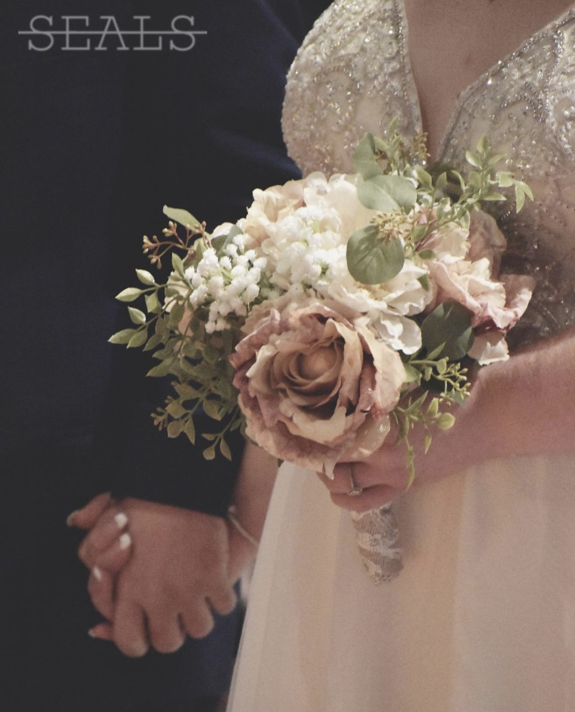
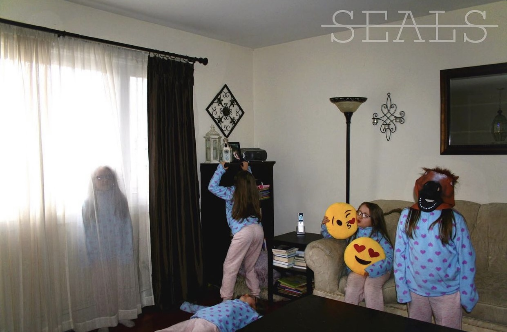
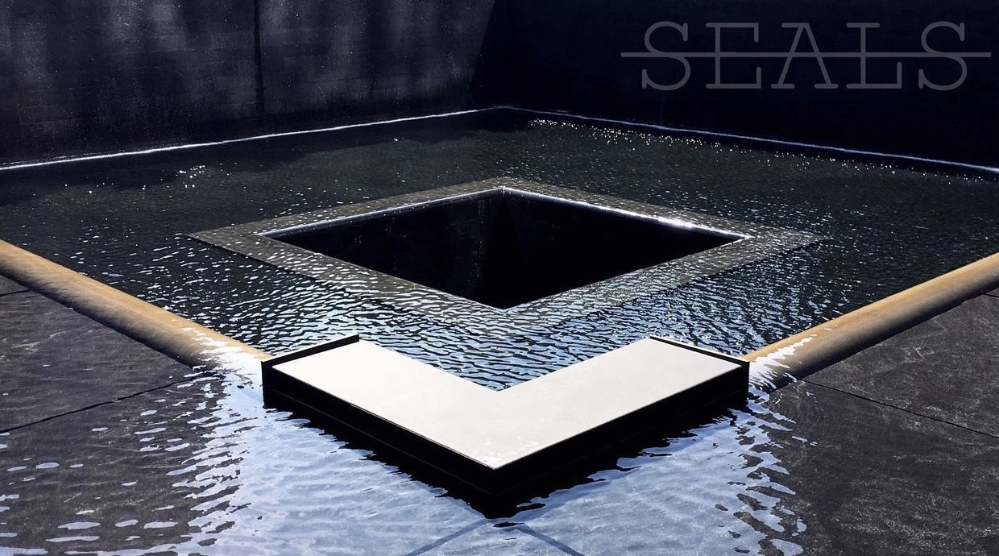

Ken Seals
<!DOCTYPE html>
<html>
<head>
<title>Ken Seals</title>
<meta charset="UTF-8">
<meta name="viewport" content="width=device-width, initial-scale=1">
<link rel="stylesheet" href="https://www.w3schools.com/w3css/4/w3.css">
<link rel="stylesheet" href="https://fonts.googleapis.com/css?family=Montserrat">
<link rel="stylesheet" href="https://cdnjs.cloudflare.com/ajax/libs/font-awesome/4.7.0/css/font-awesome.min.css">

</head>
<body class="w3-black">

<!-- Icon Bar (Sidebar - hidden on small screens) -->
<nav class="w3-sidebar w3-bar-block w3-small w3-hide-small w3-center">
  <!-- Avatar image in top left corner -->
  
  <a href="#" class="w3-bar-item w3-button w3-padding-large w3-black">
    <i class="fa fa-home w3-xxlarge"></i>
    
HOME

  </a>
  <a href="#about" class="w3-bar-item w3-button w3-padding-large w3-hover-black">
    <i class="fa fa-user w3-xxlarge"></i>
    
ABOUT

  </a>
  <a href="#photos" class="w3-bar-item w3-button w3-padding-large w3-hover-black">
    <i class="fa fa-eye w3-xxlarge"></i>
    
PHOTOS

  </a>
  <a href="#contact" class="w3-bar-item w3-button w3-padding-large w3-hover-black">
    <i class="fa fa-envelope w3-xxlarge"></i>
    
CONTACT

  </a>
</nav>

<!-- Navbar on small screens (Hidden on medium and large screens) -->

  

    <a href="#" class="w3-bar-item w3-button" style="width:25% !important">HOME</a>
    <a href="#about" class="w3-bar-item w3-button" style="width:25% !important">ABOUT</a>
    <a href="#photos" class="w3-bar-item w3-button" style="width:25% !important">PHOTOS</a>
    <a href="#contact" class="w3-bar-item w3-button" style="width:25% !important">CONTACT</a>
  

<!-- Page Content -->

  <!-- Header/Home -->
  <header class="w3-container w3-padding-32 w3-center w3-black" id="home">
    <h1 class="w3-jumbo">I'm Ken Seals.</h1>
    
Photographer and Filmmaker.

    
  </header>

  <!-- About Section -->
  

    <h2 class="w3-text-light-grey">Ken Seals</h2>
    

    
Ken Seals is a candidate for an associate of arts with a focus in AVMP from Howard Community College in Columbia, MD. She's assertive creative, full of passion. Ken creates in many mediums, such as photography, videography, cinematography, and writing. Once she starts a project she is determined to finish it, and finish it well. Even the comedy aspect of her art is well thought out and presented in its own unique way. Ken Seals desired to create her own worlds within this one by way of writing and filming. Editing videos is one of her pastimes. She enjoys working on videos and getting to see her final product. Ken loves the community of projects. The bonds that are made with the people you work with daily are something she appreciates even years after. Her high school experiences in the theater department have given her and advantage in larger productions. She has an eye for beauty in the little things. She can take a photo of nothing and make it something. Nothing is truly ugly to her. She can find the best out of the worst. She lives with small worlds of fantasy floating around in her head. Great ideas are never far from her mind. Ken loves being a part of something big and will always strive to be that way.

    <h3 class="w3-padding-16 w3-text-light-grey">My Skills</h3>
    
Photography

    

      

    

    
Film 

    

      

    

    
Photoshop

    

      

    
 

    <button class="w3-button w3-light-grey w3-padding-large w3-section">
      <i class="fa fa-download">THE Resume.docx.pdf</i> Download Resume
    </button>

  <!-- Portfolio Section -->
  

    <h2 class="w3-text-light-grey">My Photos</h2>
    

    <!-- Grid for photos -->
    

      

        
        
        
        
      

      

        
        
        
        
      

    <!-- End photo grid -->
    

  <!-- End Portfolio Section -->
  

  <!-- Contact Section -->
  

    <h2 class="w3-text-light-grey">Contact Me</h2>
    

    

      
<i class="fa fa-map-marker fa-fw w3-text-white w3-xxlarge w3-margin-right"></i> Maryland, US

      
<i class="fa fa-envelope fa-fw w3-text-white w3-xxlarge w3-margin-right"> </i> Email: kenseals16@gmail.com

    
 
      

    </form>
  <!-- End Contact Section -->
  

    <!-- Footer -->
  <footer class="w3-content w3-padding-64 w3-text-grey w3-xlarge">
    <i class="fa fa-instagram w3-hover-opacity"></i>
    <i class="fa fa-youtube w3-hover-opacity"></i>
    <i class="fa fa-vimeo w3-hover-opacity"></i>
     <i class="fa fa-flickr w3-hover-opacity"></i>
  <!-- End footer -->
  </footer>

<!-- END PAGE CONTENT -->

</body>
</html>

</body>
</html>
